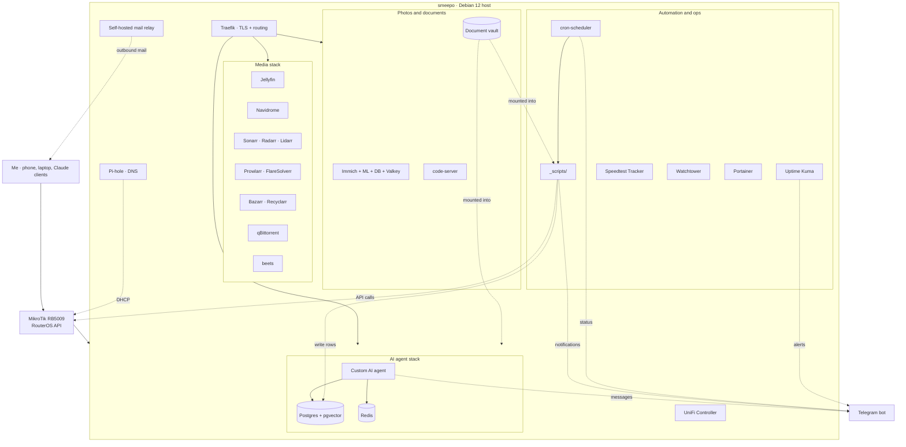

# smeepo

> A 28-container personal homelab on a single Debian box. Self-hosted media, photos, a self-hosted mail relay, document workflows, scheduled automation, a custom AI agent, and live integration with a MikroTik router over its API.

This repository is the public description of the system. The compose files and scripts are not published here — see [What's not in this repo](#whats-deliberately-not-in-this-repo-yet) for why.

---

## At a glance

| | |
|---|---|
| **Host** | One Debian 12 box, on bare metal |
| **Container runtime** | Docker + Docker Compose, organised into a handful of stacks |
| **Services** | ~28 containers across media, photos, automation, agent, and DNS |
| **Router** | MikroTik RB5009, integrated over the RouterOS API |
| **Data store** | Postgres (with `pgvector`) for the agent and a service changelog; SQLite for the lighter services |
| **Alerts** | Telegram bot for cron-job success/failure and ad-hoc notifications |
| **Backups** | Weekly tarballs of every compose file and per-service config to a separate volume |
| **External access** | Public services published behind Cloudflare with per-application auth; the router and admin surfaces stay on the LAN |
| **Operator** | One — me. Single-tenant. Single-operator. |
| **Uptime visibility** | Uptime Kuma for service-level health; Telegram bot for cron-job status |
| **Code in this repo** | None yet — see [What's not in this repo](#whats-deliberately-not-in-this-repo-yet) |

---

## What this is

`smeepo` is the personal infrastructure I run for myself. It started as a single Jellyfin container on a recycled mini-PC and grew, deliberately, into the environment described below. None of it is a product. None of it is multi-tenant. It is the place where I keep my media library, back up my photos, drive my scheduled automation, run a custom AI agent, and learn the parts of operations my day job (network solution design at a regional carrier) does not put me in front of.

I designed the architecture, picked the services, made the integration choices, and have operated it long enough to develop my own incident history. The code that runs inside is a mix of off-the-shelf images, configuration I wrote, scripts I wrote, and code I generated with an LLM and then debugged into shape. The bias of this README is toward what the system *does* and how it stays up — not toward claiming I hand-typed every line.

---

## The stack

### Media

| Service | Role |
|---|---|
| **Jellyfin** | Streaming server for movies, TV, anime, and music |
| **Navidrome** | Music-focused streaming, used in parallel with Jellyfin for the library subset |
| **Sonarr** | Series and anime automation (two profiles, separate quality logic) |
| **Radarr** | Movie automation |
| **Lidarr** | Music library automation |
| **Prowlarr** | Indexer aggregator with tag-based routing into the *arr stack |
| **Bazarr** | Subtitle automation, scored against quality thresholds |
| **Recyclarr** | Daily sync of *arr quality profiles from a curated upstream |
| **qBittorrent** | Download client behind the *arr stack |
| **FlareSolverr** | Cloudflare challenge solver for the indexers that need it |
| **beets** | Music auto-tagger; post-processes Lidarr drops before they hit the library |

### Photos and documents

| Service | Role |
|---|---|
| **Immich** | Personal photo and video library with mobile auto-backup, face detection, and search |
| **Immich support stack** | Dedicated Postgres (with `vectorchord` / `pgvecto.rs`), Redis/Valkey, and a machine-learning service for embeddings |
| **code-server** | Browser-based VS Code instance for editing files on the host without an SSH session |
| **Document vault** | Plain-filesystem document store on a dedicated volume, mounted into the agent stack and into scheduled jobs |

### Automation, monitoring, and ops

| Service | Role |
|---|---|
| **cron-scheduler** | Small Alpine container that runs the homelab's scheduled jobs from a versioned `_scripts/` directory; emits Telegram alerts on every run |
| **`_scripts/`** | Bash scripts for backups, library health checks, log rotation, the source-agnostic changelog writer, and the MikroTik integration |
| **Uptime Kuma** | Service-level uptime monitoring with its own alert channel |
| **Speedtest Tracker** | Periodic ISP-side speed tests, charted over time |
| **Watchtower** | Container image updates on a schedule, with the trade-off noted below |
| **Portainer** | Web UI for Docker, used as a read-mostly inspection surface during incidents |

### AI agent stack

| Service | Role |
|---|---|
| **Custom AI agent** | Personal LLM-driven assistant with access to the vault, the changelog, and a curated set of homelab actions |
| **Postgres + `pgvector`** | Embedding store for the agent; also hosts the homelab's `changelog` table |
| **Redis** | Cache layer for the agent stack |
| **Telegram bot** | The agent's primary interface, reused as the homelab's notification backbone |

### Network, DNS, mail

| Service | Role |
|---|---|
| **Traefik** | Reverse proxy and TLS termination for the internal service catalogue, with per-service routing rules |
| **Pi-hole** | Network-wide DNS with ad and tracker blocking, integrated into the router's DHCP |
| **UniFi Controller** | Management plane for the UniFi access points on the LAN |
| **Self-hosted mail relay** | Container that handles outbound mail for the homelab's notifications and personal sending; built locally |
| **MikroTik RB5009** | The household router. Not a container, but wired into the automation stack via the RouterOS API |

---

## How it's wired together

The pattern that holds the whole thing together is small and boring: **every scheduled job emits a Telegram message, every change to the homelab gets a row in a Postgres `changelog` table, and every service config lives in version control and gets tarballed weekly to a separate volume.** Nothing flashy — but it means that when something breaks, I find out within minutes, and when I have to remember what I did three weeks ago, I have an actual record.

---

## How I keep it running

A small set of rules that have survived the year of operation:

- **Every scheduled job alerts on both success and failure.** Silent failures are the kind that eat you six months later. The bash wrapper that drives the cron scheduler refuses to register a job without an alert hook, and Uptime Kuma provides a second, independent channel for service-level health.
- **Source-agnostic changelog.** A single Postgres table records every non-trivial change to the homelab — what changed, who initiated it (me, the agent, an automated routine), when, and why. One small bash helper writes the row. It costs nothing to maintain and pays back the first time something breaks.
- **Weekly config tarballs to a separate volume.** Every Sunday a job archives all compose files and per-service config directories into a date-stamped tarball. The volume lives outside the docker root so a container catastrophe does not take the backups with it.
- **Vault-staging pattern for the agent.** Documents that the agent processes land in a staging directory first, get reviewed, and only then move to the canonical vault. Stops a hallucinating agent from polluting the system of record.
- **"Ask before periodic" rule.** Any new cron job, watcher, webhook poll, or scheduled task requires explicit approval before it gets added. On-demand by default. This rule exists because I once spent a week tracking down a problem caused by a "small" scheduled job I'd forgotten about.
- **Watchtower with deliberate trade-offs.** Image updates run on a schedule. The convenience is real and the risk is also real — occasionally a new image breaks something silently. The mitigation is the Uptime Kuma channel plus the changelog, so a regression caused by an automatic update is loud rather than quiet. Critical services can be opted out of Watchtower individually when the risk does not pencil.
- **Public services sit behind Cloudflare with per-application auth.** The router itself and the admin surfaces stay on the LAN. Anything public has its own login screen; nothing is reachable without one.

---

## Things that went wrong, and what I changed

Two case studies, kept short, because the lessons are the point.

### The MikroTik DNS-NAT incident

Early in the router-integration work I pushed a RouterOS configuration change that altered a DNS-NAT rule in a way that effectively bricked outbound name resolution for the whole household. Took roughly an hour to diagnose and revert, with the family looking at me unkindly.

What changed afterward:
- **Hard rules captured in writing** on which RouterOS object classes I will and will not touch from automation, with a short rationale for each.
- **Dry-run mandatory** for any script that mutates router state — print the proposed change first, confirm, then apply.
- **Backup-before-mutation** is now non-optional. The router exports a config snapshot to the homelab before any scripted change runs.

The lesson, in one sentence: *infrastructure that the household depends on gets a different review bar than infrastructure that only I depend on.*

### The cron-scheduler rename

The scheduler container was originally named after the agent (`crabo-cron`). Over time the scheduler's responsibilities outgrew the agent's — it was scheduling jobs that had nothing to do with the agent at all, and the misleading name kept making me look in the wrong place during debugging. I eventually renamed the container, the compose service, and every reference in the scripts to `cron-scheduler` and logged the rename in the changelog.

The lesson: *naming hygiene is operational hygiene. A container name that lies costs you a few seconds of misdirection every time you debug, and those seconds compound.*

---

## Why I run this

Three reasons, roughly in order of importance:

1. **I want to own the storage and the access patterns for my own data.** My photos, my music library, my documents, my note vault. The trade-off of running my own hardware against renting a subscription is one I am happy with for these categories.
2. **I want a continuous hands-on counterweight to my day job.** I work on the design side of a regional carrier's service stack. That is coordination work, not engineering work, and the day-to-day is meetings and proposal authoring. The homelab is where the wrench-turning lives.
3. **I want a sandbox big enough to test ideas in.** Including the custom AI agent, the personal MCP server (separate repo, in progress), the document workflows, and whatever I want to wire up next.

---

## What's deliberately not in this repo (yet)

Setting expectations honestly:

- **The compose files and scripts are not published here yet.** Sanitising them properly — IP ranges, internal hostnames, API tokens, paths that contain my name — is real work that I have not yet committed to. The README is the first deliverable; code follows when I have decided what to publish and what to keep private.
- **No multi-tenant or high-availability design.** This is a single-operator environment. If the host reboots, services come back when Docker comes back. There is no zero-downtime story and there will not be one. That is the right trade-off for the use case.
- **No claim that this is production-grade infrastructure for anyone other than me.** The patterns above (alerting, changelog, backups) are the parts I think generalise. The specific choices of services and the topology are tuned to one household.
- **AI-assisted development is part of the story.** A meaningful share of the scripts and configurations were generated with LLM assistance and then debugged into shape. The decisions about what the system does, how the pieces fit together, what to keep, what to throw out, and how to recover when something breaks are mine. I think that division of labour is the honest contemporary version of "I built this", and I would rather state it plainly than imply otherwise.

---

## Roadmap

Loose, in priority order:

1. Ship the personal MCP server (separate repository, in active development) and wire it into the agent stack.
2. Decide what subset of compose files and scripts is publishable, sanitise it, and add it to this repository.
3. Fix the inherited photo-metadata mess on the older Samsung S9 / S21 dumps in the Immich library.
4. Replace one or two of the off-the-shelf services with something I have actually written.

I am not promising dates. I am listing direction.

---

## Author

Hashem Touqan · [LinkedIn](https://www.linkedin.com/in/hashemtouqan/) · [Profile README](https://github.com/HTouqan)
